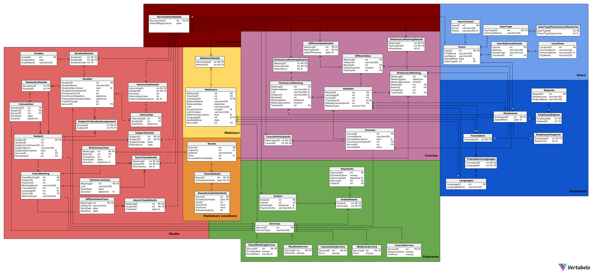

# Database Management System for Hybrid Educational Services

## Authors
- Jakub Kaliński
- Michał Szymocha
- Emil Żychowicz

## Database schema

## Project Overview
This project implements a database system for a company offering various training programs, including webinars, courses, and study programs. The system manages event scheduling, participant registrations, payments, and reporting while ensuring data integrity and access control.

## Features
- **Reporting & Analytics**: Generates financial reports, attendance records, and conflict detection reports.
- **User Roles & Permissions**: Admins, instructors, and participants have defined access rights.
- **Event Management**: Tracks webinars, courses, and study programs with details like schedule, location, and instructor.
- **Payment Handling**: Supports order creation, tracking, and integration with an external payment provider.
- **Attendance & Completion Tracking**: Verifies participation and completion criteria for certifications.
- **Data generator**: Python script generates data in topological order to ensure data consistency.

## Files  
- [`database_flow/`](database_flow/) – contains SQL code showing how different views, procedures, and triggers work together.  
- [`indexes/`](indexes/) – database index definitions for query optimization.  
- [`procedures/`](procedures/) – SQL scripts for stored procedures.  
- [`roles/`](roles/) – definitions of user roles and database permissions.  
- [`triggers/`](triggers/) – SQL triggers ensuring data consistency.  
- [`views/`](views/) – SQL views for easier reporting and data access.  
- [`dataGenerator.py`](dataGenerator.py) – script for generating data.  
- [`database_schema.png`](database_schema.png) – database schema diagram.  
- [`documentation.pdf`](documentation.pdf) – full project documentation. 
